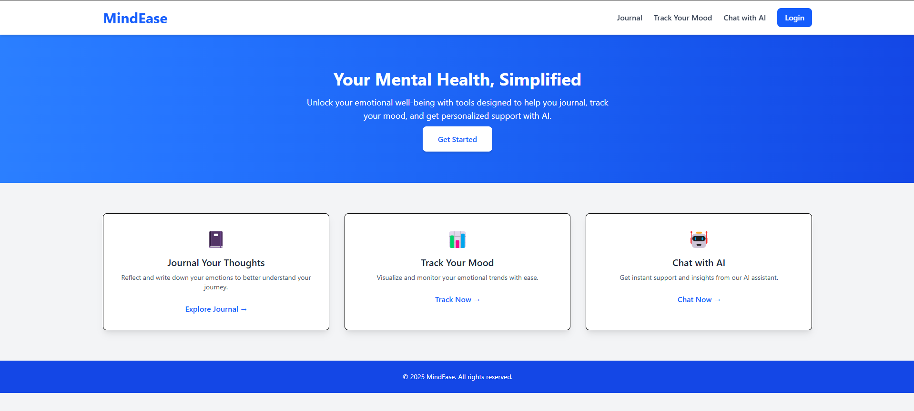
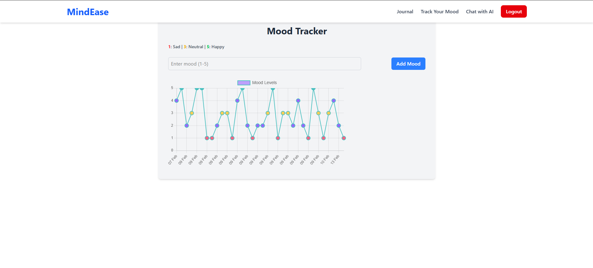
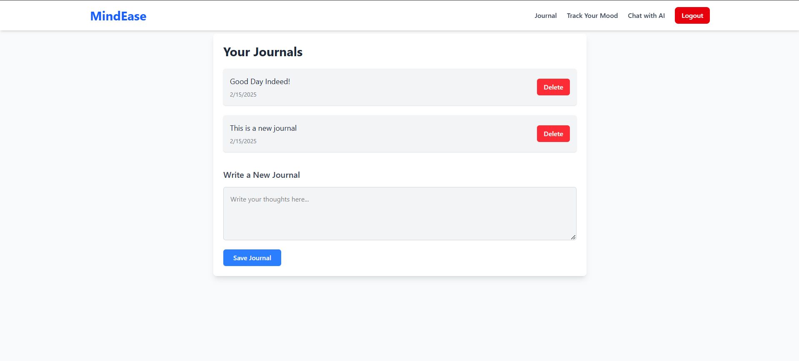
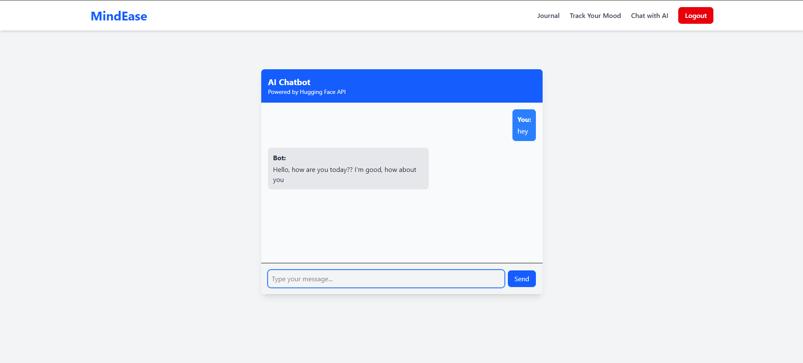

# MindEase - Your AI-Powered Mental Health Companion


## 🧠 About MindEase
MindEase is an AI-powered mental health companion designed to provide support, guidance, and tools to enhance mental well-being. It offers features like AI therapy, journaling, mood tracking, and anonymous group discussions to create a safe space for users to manage their emotions and mental health.

## ✨ Features
- **📔 Journaling** - Record daily thoughts and emotions with an intuitive journaling feature.
- **📊 Mood Tracker** - Visualize your emotional patterns through insightful charts.
- **🗣 AI Chat** - Chat with an AI-powered assistant for mental health support.

## 🚀 Tech Stack
- **Frontend:** React.js, Tailwind CSS
- **Backend:** Node.js, Express.js
- **Database:** MongoDB
- **AI Services:** Huggingface API
- **Authentication:** JWT & OAuth

## 🛠 Installation
1. Clone the repository:
   ```bash
   git clone https://github.com/yourusername/mindease.git
   cd mindease
   ```
2. Install dependencies:
   ```bash
   npm install
   ```
3. Set up environment variables in a `.env` file:
   ```plaintext
   MONGO_URI=your_mongodb_connection_string
   OPENAI_API_KEY=your_openai_api_key
   JWT_SECRET=your_secret_key
   ```
4. Start the development server:
   ```bash
   npm run dev
   ```

## 📸 Screenshots
### 🏠 Home Page


### 📊 Mood Tracker


### 📔 Journaling Feature


### 💬 Chat with AI


## 🏗 Future Enhancements
- 🔄 Custom AI model for therapy
- 🎨 Customizable Themes
- 📅 Habit & Goal Tracker
- 🧘 Guided Meditation Sessions

## 🤝 Contributing
Contributions are welcome! If you'd like to improve MindEase, follow these steps:
1. Fork the repository
2. Create a feature branch (`git checkout -b feature-name`)
3. Commit your changes (`git commit -m 'Added new feature'`)
4. Push to the branch (`git push origin feature-name`)
5. Open a Pull Request

## 💌 Contact
💼 **LinkedIn:** (https://www.linkedin.com/in/fazal-memon/)  

---
> *"Your mental health matters. MindEase is here to support you."*

